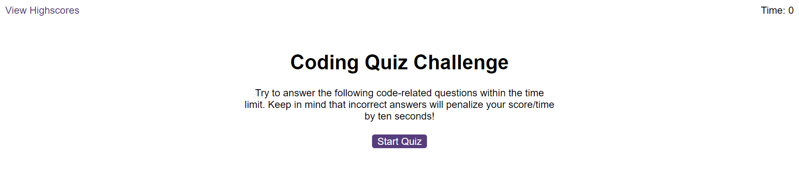
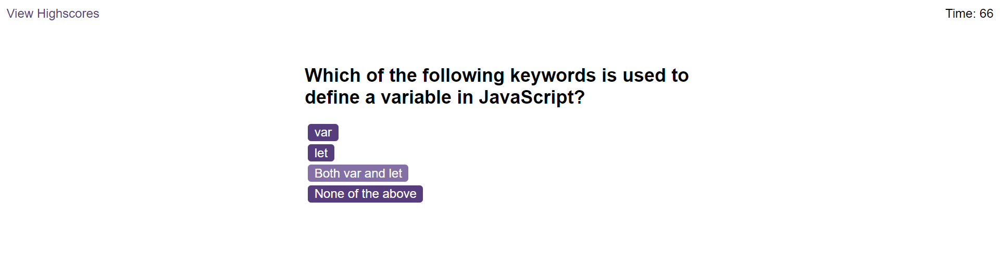

# Coding-Quiz

## Description

My motivation for this project was to use JavaScript to create a timed coding quiz on JavaScript fundamentals with multiple choice questions and  that stores high scores in score order. This solves a problem of revising for a coding assessment and also gauging my progress by going through the questions and seeing what score I get each time. 

## Screenshot

## Installation

N/A

## Usage

This webpage can be used to revise your JavaScript knowledge by clicking start quiz, then clicking on each answer to submit what you think is the correct answer. It will give a sound and also let you know at the bottom if you got the questions right or not and at the end of the quiz you can type in your initials and submit them to the high score leader board. If you click on the View High scores link in the top left it will take you to a leader board of all scores submitted on your browser and show them in score order. If you click the clear high scores button you can clear the scoreboard and also the local storage for the website.

## Link

https://mtlightfoot.github.io/coding-quiz/

## Credits

N/A

## License

Please refer to the LICENSE in the repo.